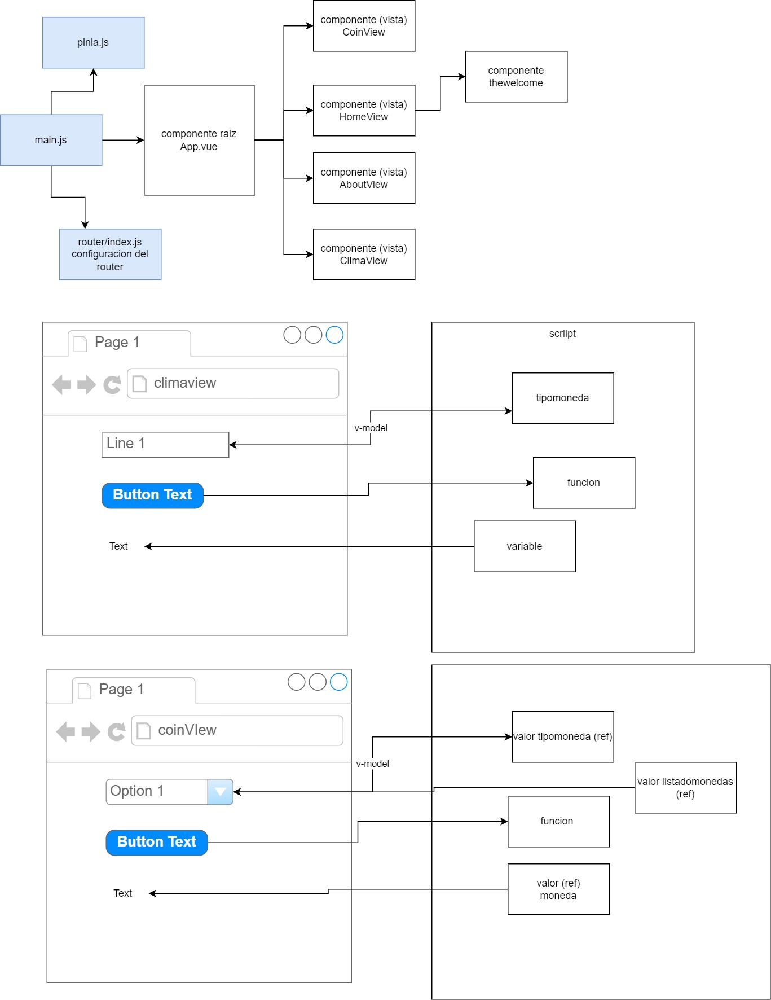

# cursojs20230821

* Este es un proyecto que va a usar vue-router y pinia

# javascript

```js
let objeto={
    campo:"hola", // una variable dentro de otra variable
    campo2:222,
    metodo: function() { // una variable que tiene una funcion (metodo)

    },
    metodo2() => { // se puede definir la funcion con doble flecha

    }
    campo3:{ // una variable que tenga dentro otra variable, y esa otra variable tenga otras variables
        campo4:222,
        campo5:"aaa"
    },
    campo4:[1,2,3,4,5] // una variable que sea un listado de valores.
}
```

# axios
Buscar por axios
* https://www.npmjs.com/search?q=axios
Instalar axios:
> npm i axios

## como usar axios?
1) importar axios
```js
import axios from 'axios';
```
2) Y llamar a la funcion

```js
axios({
  method: 'post',
  url: '/user/12345',
  data: {
    firstName: 'Fred',
    lastName: 'Flintstone'
  }
});
```

Esta funcion es asincronica.

```js
axios({
  method: 'get',
  url: '/user/12345',
  data: {
    firstName: 'Fred',
    lastName: 'Flintstone'
  }
})
 .then(function (response) {
    console.log(response);
  })
  .catch(function (error) {
    console.log(error);
  });
```


3) Ejemplo:
// 33.4489° S, 70.6693° W
//  latitud -33.45694 y longitud -70.64827

> https://api.open-meteo.com/v1/forecast?latitude=52.52&longitude=13.41&current_weather=true&hourly=temperature_2m,relativehumidity_2m,windspeed_10m


# vue route

## 1-agregar vista

* en la carpeta views crear un componente vue nuevo (puede ser otra carpeta)

## 2- modificar el router/index.js y vincular el componente a una url.

```js
    ,
    {
      path: '/clima',
      name: 'clima',
      component: () => import('../views/ClimaView.vue')
    }
```

## 3- opcionalmente, agregar un vinculo para poder acceder a la vista
Esto se puede agregar en el componente raiz

```js
   <RouterLink to="/clima">Clima</RouterLink>   
```
En alguna parte de la pagina tiene que indicarse donde se van a ver las vistas
```js
  <RouterView />
```


# diagrama del ejercicio

